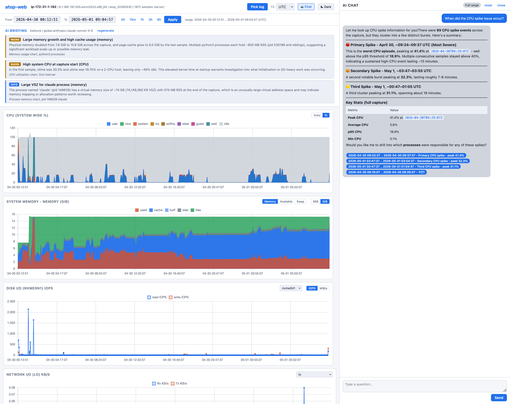

# atop-web

Web based visualization and analysis tool for atop rawlog files.

atop-web reads atop binary rawlog files directly (no `atop -P` preprocessing
required) and renders system and process level metrics in a browser. It targets
users who want to inspect atop captures without learning the curses interface.



## Features

- Direct parsing of atop binary rawlog via `dissect.cstruct`
- Server side file browser over the mounted log directory for one click
  analysis of rawlog files already on disk
- Ad hoc upload of arbitrary rawlog files for quick investigations
- FastAPI backend exposing JSON endpoints for samples, processes, and summary
- Single page frontend using Chart.js for time series charts
- Process (tstat) drill down: click a time point to see per process CPU, memory,
  disk, and network counters
- Runs entirely in Docker, no host Python required
- AI briefing and chat (AWS Bedrock; OpenAI / Anthropic / Gemini scaffolded, not yet implemented)

## Project layout

```
atop_web/
  main.py              FastAPI application entry point
  parser/              rawlog binary parser
    layouts/           CDEF definitions for rawlog structures
    reader.py          header + sample iteration
    decompress.py      zlib helpers
  api/routes/          REST endpoints (upload, samples, processes, summary)
  static/              index.html, app.js, style.css
tests/                 pytest suite
```

## Quick start

The project runs only via Docker. Do not invoke `python`, `pip`, or `venv` on
the host.

### Run from the prebuilt image (recommended)

A prebuilt image is published to GitHub Container Registry:

```
docker pull ghcr.io/chhanz/atop-web:latest

docker run -d --name atop-web \
  -p 8000:8000 \
  -v /var/log/atop:/app/logs:ro \
  ghcr.io/chhanz/atop-web:latest
```

Tags: `latest` and `vX.Y.Z` per release. See [GHCR](https://github.com/chhanz/atop-web/pkgs/container/atop-web) for all versions. Image is ~200MB, runs on x86_64.

Then open `http://localhost:8000`. Files under `/var/log/atop` on the host
appear in the "Server log directory" panel.

### Build the image

```
docker compose build
```

### Run the tests

```
docker compose run --rm test
```

### Start the server

```
docker compose up -d
```

## Primary workflow: open a file already on the server

The expected production setup is that atop writes rawlog files under
`/var/log/atop` on the host, and the container bind mounts that directory read
only. The web UI then lists those files and opens them with a single click, no
upload required.

1. `atop -w /var/log/atop/atop_$(date +%Y%m%d)` runs on the host (either
   directly or via the standard atop service) to produce rawlog files.
2. `docker compose up -d` starts atop-web with the mount in place.
3. Open the UI. The top bar shows a "Server log directory" panel listing the
   files in `/var/log/atop`, newest first. Click any file to load it.

Under the hood the picker is backed by:

- `GET  /api/files`         returns the filtered, sorted list of candidate files
- `POST /api/files/parse`   opens a file by name, returns a session id

Path traversal is blocked: names must match `[A-Za-z0-9._-]+`, and the resolved
real path must stay inside `ATOP_LOG_DIR` after symlink resolution.

If `ATOP_LOG_DIR` points at a missing directory, the panel hides itself and the
UI falls back to the upload form.

## Secondary workflow: ad hoc upload

The top bar also hosts an "Upload ad hoc" form for analyzing a rawlog file that
is not on the server (for example one copied from another machine). Uploads
are held in memory for the duration of the process only; restart the container
to drop all sessions.

### Running behind a reverse proxy (sub path deployment)

atop-web is designed to run at the origin root (for example
`http://host:8000/`) or under an arbitrary sub path (for example
`https://docs.example.com/atop/`) without code changes.

**How it works.** The reverse proxy strips the external prefix before
forwarding the request, so the application always sees paths starting at
`/` internally. `ATOP_ROOT_PATH` only controls the value injected into the
HTML `<base href>`, which tells the browser to resolve relative URLs
(`static/...`, `api/...`) against the external prefix so they travel back
through the proxy on the next hop.

Deployment checklist:

1. Strip the prefix at the proxy. With nginx that means `proxy_pass` with a
   trailing slash; with Caddy `handle_path`; with Traefik a `stripPrefix`
   middleware.
2. Forward the usual `X-Forwarded-*` headers.
3. Set `ATOP_ROOT_PATH=/your-prefix` on the `atop-web` container.

Do **not** set FastAPI's `root_path` on top of a stripping proxy. That would
make the application expect the prefix twice and break the static mount.

#### nginx

```nginx
location /atop/ {
    proxy_pass http://atop-web:8000/;          # trailing slash strips prefix
    proxy_set_header Host $host;
    proxy_set_header X-Forwarded-For $proxy_add_x_forwarded_for;
    proxy_set_header X-Forwarded-Proto $scheme;
}
```

Container: `ATOP_ROOT_PATH=/atop`.

#### Caddy

```
docs.example.com {
    handle_path /atop/* {
        reverse_proxy atop-web:8000
    }
}
```

`handle_path` rewrites the request so atop-web sees `/...` with no prefix.
Container: `ATOP_ROOT_PATH=/atop`.

#### Traefik (Docker labels)

```yaml
services:
  atop-web:
    environment:
      ATOP_ROOT_PATH: /atop
    labels:
      - "traefik.enable=true"
      - "traefik.http.routers.atop.rule=Host(`docs.example.com`) && PathPrefix(`/atop`)"
      - "traefik.http.routers.atop.entrypoints=web"
      - "traefik.http.routers.atop.middlewares=atop-stripprefix"
      - "traefik.http.middlewares.atop-stripprefix.stripprefix.prefixes=/atop"
      - "traefik.http.services.atop.loadbalancer.server.port=8000"
```

The shipped `docker-compose.yml` already contains this layout.

### Local development (no reverse proxy)

The `atop-web` service does not publish any host ports by default. To hit
the app directly without a proxy, uncomment the `ports:` block in
`docker-compose.yml`, leave `ATOP_ROOT_PATH` unset (or set it to an empty
string), and run:

```
HOST_PORT=18000 docker compose up -d atop-web
```

Then open http://localhost:18000/ in a browser.

## Configuration

| Variable          | Default          | Purpose                                                        |
| ----------------- | ---------------- | -------------------------------------------------------------- |
| `ATOP_LOG_DIR`    | `/var/log/atop`  | Directory containing atop rawlog files; drives the server file browser. Leave empty or set to a non existent path to disable the browser and rely on uploads only. |
| `ATOP_ROOT_PATH`  | `""`             | External URL prefix when running behind a prefix stripping proxy (injected as HTML `<base href>`; do not include a trailing slash) |
| `HOST_PORT`       | `8000`           | Host port for the optional local debug mapping                 |
| `LLM_PROVIDER`    | `none`           | LLM backend selector. Currently only `bedrock` is functional; `ollama`, `openai`, `anthropic`, `gemini` are scaffolded but not yet implemented. Leave as `none` to disable AI briefing and chat. |
| `BEDROCK_MODEL`   | `global.anthropic.claude-sonnet-4-6` | Bedrock inference profile or model id (used when `LLM_PROVIDER=bedrock`). |
| `AWS_REGION`      | `ap-northeast-2` | AWS region for Bedrock Runtime. `AWS_DEFAULT_REGION` is also honored. |
| `AWS_ACCESS_KEY_ID` | _(empty)_      | Optional static credentials. Leave empty to use the EC2 instance profile / IMDSv2 / default boto3 credential chain. |
| `AWS_SECRET_ACCESS_KEY` | _(empty)_  | Paired with `AWS_ACCESS_KEY_ID`. |
| `AWS_SESSION_TOKEN` | _(empty)_      | For STS temporary credentials (SSO / AssumeRole). |
| `AWS_BEARER_TOKEN_BEDROCK` | _(empty)_ | Bedrock API key (boto3 >= 1.39). Alternative to IAM credentials, scoped to `bedrock-runtime` only. Takes precedence over the default credential chain when set. |

Leave `ATOP_ROOT_PATH` empty for root deployment. Set it to the external
prefix (for example `/atop`) when running behind a reverse proxy that strips
that prefix before forwarding; see the reverse proxy section above for the
full configuration.

### Enabling AI features

AI briefing and chat are disabled by default (`LLM_PROVIDER=none`). To enable
them with AWS Bedrock:

1. Authenticate the host to Bedrock. Choose one of the following, in order of
   preference:

   - **EC2 instance profile (strongly recommended for production)** - attach
     an IAM role to the EC2 instance with `bedrock:InvokeModel`,
     `bedrock:Converse`, and `bedrock:ConverseStream` permissions. No secrets
     touch the host filesystem, credentials rotate automatically via IMDSv2,
     and there is nothing to leak in `docker inspect`, shell history, or
     compose files. This is the safest option and should be the default for
     any non-local deployment.
   - **Bedrock API key** - set `AWS_BEARER_TOKEN_BEDROCK` with a key minted
     from the Bedrock console. Simpler than IAM for standalone or
     non-EC2 hosts (requires boto3 >= 1.39, scoped to `bedrock-runtime` only).
     Treat it as a long-lived secret: prefer a `.env` file outside the repo
     or a secrets manager, never commit it.
   - **Static IAM credentials** - set `AWS_ACCESS_KEY_ID` and
     `AWS_SECRET_ACCESS_KEY` (plus `AWS_SESSION_TOKEN` for STS / SSO /
     AssumeRole). Discouraged for production because long-lived access keys
     are the most common source of AWS credential leaks.

2. Grant model access for the chosen inference profile in the Bedrock
   console (region-scoped).

3. Export the non-secret variables before `docker compose up`:

   ```bash
   export LLM_PROVIDER=bedrock
   export AWS_REGION=ap-northeast-2
   export BEDROCK_MODEL=global.anthropic.claude-sonnet-4-6
   docker compose up -d
   ```

   With an EC2 instance profile, that is all. If you are using an API key
   or static credentials, also export them in the same shell (or put them
   in a `.env` file that is excluded from version control).

Other providers (`openai`, `anthropic`, `gemini`, `ollama`) are accepted by
`LLM_PROVIDER` but currently raise `NotImplementedError`; they remain on the
roadmap for future releases.

## API

| Method | Path                | Description                                         |
| ------ | ------------------- | --------------------------------------------------- |
| GET    | `/api/files`        | List candidate rawlog files in `ATOP_LOG_DIR`       |
| POST   | `/api/files/parse`  | Parse a server file by name, returns a session id   |
| POST   | `/api/upload`       | Upload a rawlog file, returns a session id          |
| GET    | `/api/dashboard`    | Summary + charts + processes in one fan-out payload |
| GET    | `/api/samples`      | Time series for CPU, memory, disk, network          |
| GET    | `/api/processes`    | Process (tstat) list for a specific sample time     |
| GET    | `/api/summary`      | Hostname, kernel, sample count, time range, etc.    |

The `/api/samples`, `/api/processes` and `/api/summary` endpoints accept a
`session` query parameter returned by the two parse entry points.

## Performance notes

- Large rawlog files (hundreds of MB) are decoded lazily through an offset
  index and an mmap over the file, so the parser keeps Python heap usage flat
  regardless of the capture size. Set `ATOP_LAZY=0` to fall back to the
  eager decoder if the lazy path hits a regression.
- The chart endpoints (`/api/samples/system_*`) downsample to one sample per
  minute on windows longer than a minute. Sub-minute windows keep full
  per-sample resolution for tooltip accuracy.
- `/api/dashboard` is the fast path the frontend uses for first paint and
  filter changes: one fetch serves the summary, all four charts and the
  process table together. Responses are cached per session for
  `ATOP_RESPONSE_CACHE_TTL` seconds (default 300s, cap 32 entries via
  `ATOP_RESPONSE_CACHE_MAX`). The same-range refresh latency drops from
  several seconds to milliseconds inside the TTL window.

## Compatibility

atop-web parses rawlogs produced by the following atop releases, validated
against in-house captures on 2026-05-06:

| OS                 | atop   | Status    |
| ------------------ | ------ | --------- |
| RHEL 8.10 / 9.7    | 2.7.1  | Supported |
| RHEL 10.1          | 2.11.1 | Supported |
| Ubuntu 24.04       | 2.10.0 | Supported |
| Ubuntu 26.04       | 2.12.1 | Supported |
| SLES 15-SP7 / 16.0 | 2.11.1 | Supported |
| Amazon Linux 2     | 2.7.1  | Supported |
| Amazon Linux 2023  | 2.12.x | Supported |

The binary layout is defined in `atop_web/parser/layouts/*.cdef`; adding a new
rawlog revision requires a new CDEF and a `SPEC_...` entry in `reader.py`.
See [docs/COMPATIBILITY.md](docs/COMPATIBILITY.md) for the full matrix,
dispatch internals, and the validation snippet for new atop versions.

## License

Apache License 2.0.
